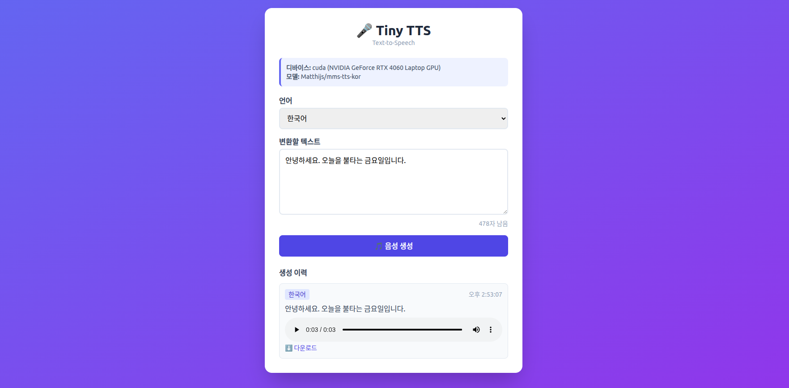

# 🎤 Tiny TTS Project

Meta MMS(Massively Multilingual Speech) 모델 기반의 다국어 Text-to-Speech 웹
애플리케이션입니다. **FastAPI 백엔드 + Vue 3 SPA** 구조이며, 레거시 CLI 도구도
함께 제공합니다.

> **기본 모델**: `Matthijs/mms-tts-kor` (한국어 TTS)
> **대상 환경**: Ubuntu 22.04 + NVIDIA RTX 4060 8GB (CUDA), CPU 폴백 지원

## 데모



브라우저에서 언어를 선택하고 텍스트를 입력하면 음성이 생성되며, 생성 이력에서
바로 재생·다운로드할 수 있습니다.

## ✨ 기능

- 🌐 **웹 인터페이스** — Vue 3 SPA, 텍스트 입력 → 즉시 음성 생성·재생
- 🗣️ **다국어 지원** — 한국어 / 영어 / 스페인어 / 프랑스어 모델 전환
- 📜 **생성 이력** — 세션 내 생성 결과 재생 및 다운로드
- ⚡ **GPU 가속** — CUDA 자동 감지, 미지원 시 CPU 폴백
- 🧰 **CLI 도구** — 단일 변환 / 대화형 모드 스크립트 제공

## 📂 프로젝트 구조

```
tiny-tts-project/
├── backend/                    # FastAPI 백엔드 + TTS 엔진
│   ├── app.py                  # FastAPI 앱 (REST API, 정적 서빙)
│   ├── tts_engine.py           # TTSEngine — 모델 로딩·로마자 변환·합성
│   ├── tts.py                  # [CLI] 단일 텍스트 → wav 변환
│   ├── interactive_tts.py      # [CLI] 대화형 TTS
│   ├── web_tts.py              # [레거시] 구버전 Flask 웹 (app.py로 대체됨)
│   ├── requirements.txt        # Python 의존성
│   └── outputs/                # 생성된 wav 저장 (최대 20개 유지)
├── frontend/                   # Vue 3 SPA (Vite + Tailwind CSS)
│   ├── src/
│   │   ├── App.vue             # 루트 컴포넌트
│   │   ├── api.js              # 백엔드 호출 래퍼
│   │   └── components/         # TtsForm.vue / HistoryList.vue
│   └── package.json
├── docs/                       # 아키텍처·UML 문서
│   ├── ARCHITECTURE.md
│   └── UML.md
├── demo.png
└── README.md
```

## 🚀 빠른 시작

### 사전 준비

- Python 3.8 이상
- Node.js 18.18+ 또는 20 이상
- (선택) NVIDIA GPU + CUDA Toolkit 11.8 이상

### 1. 백엔드 설정

```bash
cd backend

# 가상환경 (권장)
python3 -m venv venv && source venv/bin/activate

# 의존성 설치
pip install --upgrade pip
pip install -r requirements.txt

# GPU 사용 시 PyTorch CUDA 버전 설치 (CUDA 11.8 예시)
pip install torch torchaudio --index-url https://download.pytorch.org/whl/cu118
```

> **한국어 처리 안내**: `Matthijs/mms-tts-kor` 모델은 텍스트를 로마자로 변환하기
> 위해 `uroman` 패키지가 필요합니다. `requirements.txt`에 포함되어 있습니다.

### 2. 프론트엔드 설정

```bash
cd frontend
npm install
```

### 3. 개발 모드 실행

터미널 2개에서 각각 실행합니다.

```bash
# 터미널 1 — 백엔드 (:8000)
cd backend
uvicorn app:app --reload --port 8000

# 터미널 2 — 프론트엔드 (:5173)
cd frontend
npm run dev
```

브라우저에서 **http://localhost:5173** 접속.
Vite가 `/api` 요청을 `:8000`으로 프록시하므로 CORS 설정 없이 동작합니다.

### 4. 운영 모드 실행

프론트엔드를 빌드하면 백엔드가 정적 파일까지 단일 서버로 서빙합니다.

```bash
# 프론트엔드 빌드 → frontend/dist/
cd frontend && npm run build

# 백엔드 단독 실행 (dist/ 자동 서빙)
cd backend && python app.py
```

브라우저에서 **http://localhost:8000** 접속.

## 🔌 API 명세

| 메서드 | 경로 | 설명 |
|--------|------|------|
| `GET` | `/api/status` | 디바이스·모델 상태 및 지원 언어 목록 |
| `POST` | `/api/generate` | 텍스트(1~500자) → wav 생성, `{ filename }` 반환 |
| `GET` | `/api/audio/{filename}` | 생성된 wav 파일 반환 |

지원 언어 모델:

| 언어 | 모델 |
|------|------|
| 한국어 (기본) | `Matthijs/mms-tts-kor` |
| 영어 | `facebook/mms-tts-eng` |
| 스페인어 | `facebook/mms-tts-spa` |
| 프랑스어 | `facebook/mms-tts-fra` |

## 🧰 CLI 도구 (선택)

웹 인터페이스 없이 터미널에서 직접 변환할 수 있습니다. `backend/` 디렉토리에서
실행합니다.

```bash
cd backend

# 단일 텍스트 변환 (기본 출력: output.wav)
python tts.py "안녕하세요, 반갑습니다."

# 출력 파일명 / 모델 지정
python tts.py "Hello, how are you?" -o english.wav --model facebook/mms-tts-eng

# CPU 모드 강제
python tts.py "테스트" --cpu

# 대화형 모드
python interactive_tts.py
```

## 🎯 RTX 4060 8GB 호환성

✅ **여유롭게 동작합니다.**

- 모델 크기: ~200-400MB (VITS 아키텍처)
- 추론 시 VRAM 사용량: 약 1-2GB (8GB 중 6-7GB 여유)
- 추론 속도: 실시간보다 빠름
- 동시에 1개 모델만 메모리 상주하며, 모델 전환 시 이전 VRAM을 회수합니다.

## 🛠️ 문제 해결

**백엔드 연결 실패 (`백엔드에 연결할 수 없습니다`)**
→ `uvicorn`이 `:8000`에서 실행 중인지 확인하세요.

**CUDA 인식 안 됨**
```bash
nvidia-smi                                          # 드라이버 확인
python -c "import torch; print(torch.cuda.is_available())"
```
→ `False`이면 CUDA 버전에 맞는 PyTorch를 재설치하세요.

**모델 다운로드 오류**
→ 모델은 최초 실행 시 HuggingFace Hub에서 자동 다운로드됩니다.
네트워크 문제 시 `huggingface-cli login`으로 로그인하세요.

**메모리 부족**
→ CLI는 `--cpu` 옵션으로 CPU 모드 전환이 가능합니다.

**uroman 관련 오류 (한국어)**
```bash
pip install uroman
python -c "from uroman import Uroman; print('OK')"
```

## 📖 문서

- [`docs/ARCHITECTURE.md`](./docs/ARCHITECTURE.md) — 시스템 아키텍처, 계층 구조, 처리 흐름
- [`docs/UML.md`](./docs/UML.md) — 클래스·시퀀스·상태 다이어그램 (Mermaid)

## 📦 기술 스택

| 영역 | 기술 |
|------|------|
| 백엔드 | FastAPI, Uvicorn |
| ML 런타임 | PyTorch, Transformers (VITS), CUDA |
| 음성 모델 | Meta MMS-TTS |
| 오디오 I/O | soundfile, scipy |
| 텍스트 전처리 | uroman |
| 프론트엔드 | Vue 3, Vite, Tailwind CSS |

## 📄 라이선스

이 프로젝트는 교육 및 개인 용도로 자유롭게 사용할 수 있습니다.
사용된 모델(MMS-TTS)은 Meta AI의 라이선스를 따릅니다.

## 🔗 참고 자료

- [MMS-TTS 모델](https://huggingface.co/facebook/mms-tts)
- [Transformers 문서](https://huggingface.co/docs/transformers)
- [PyTorch 설치 가이드](https://pytorch.org/get-started/locally/)
