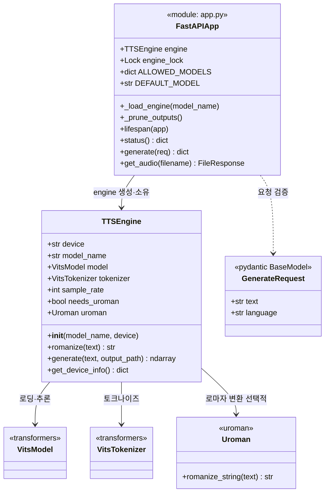
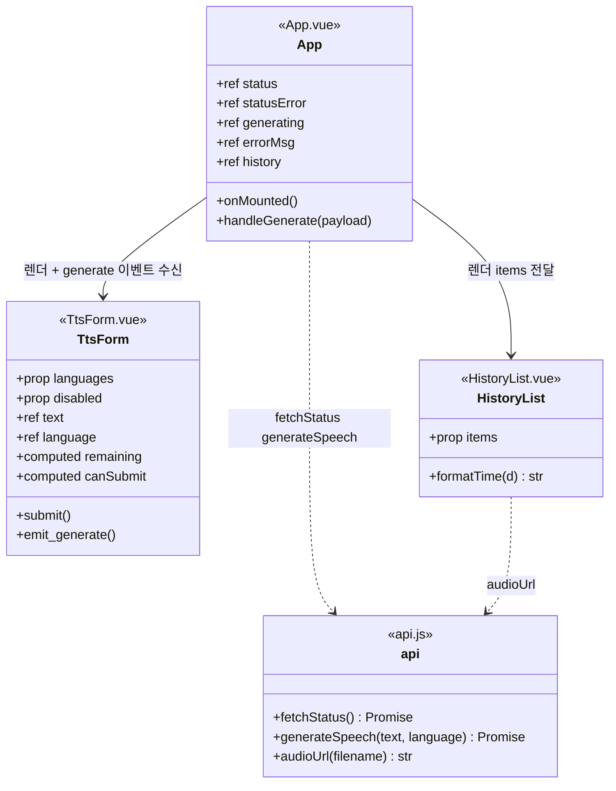
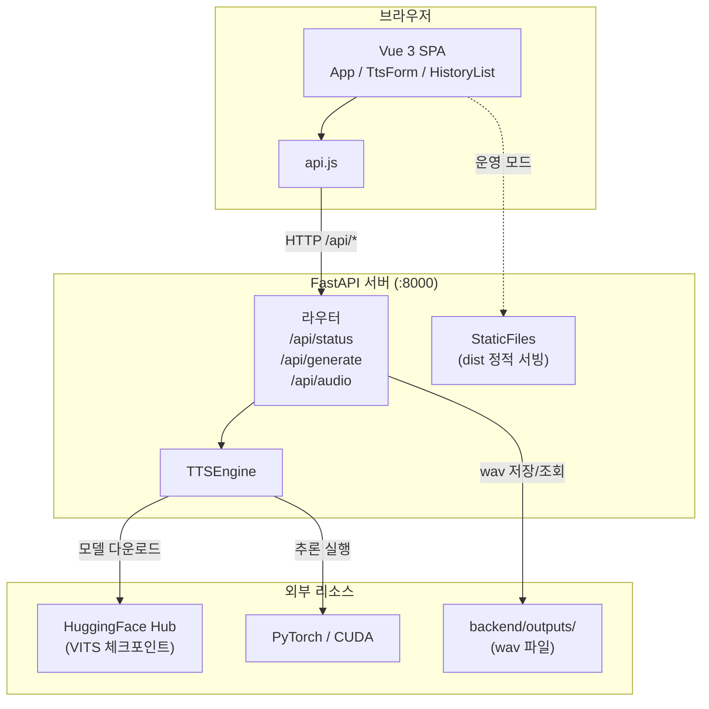
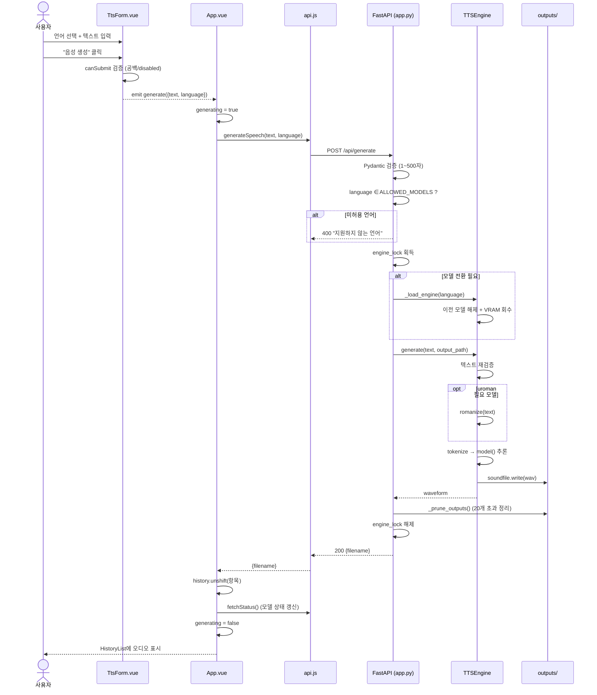
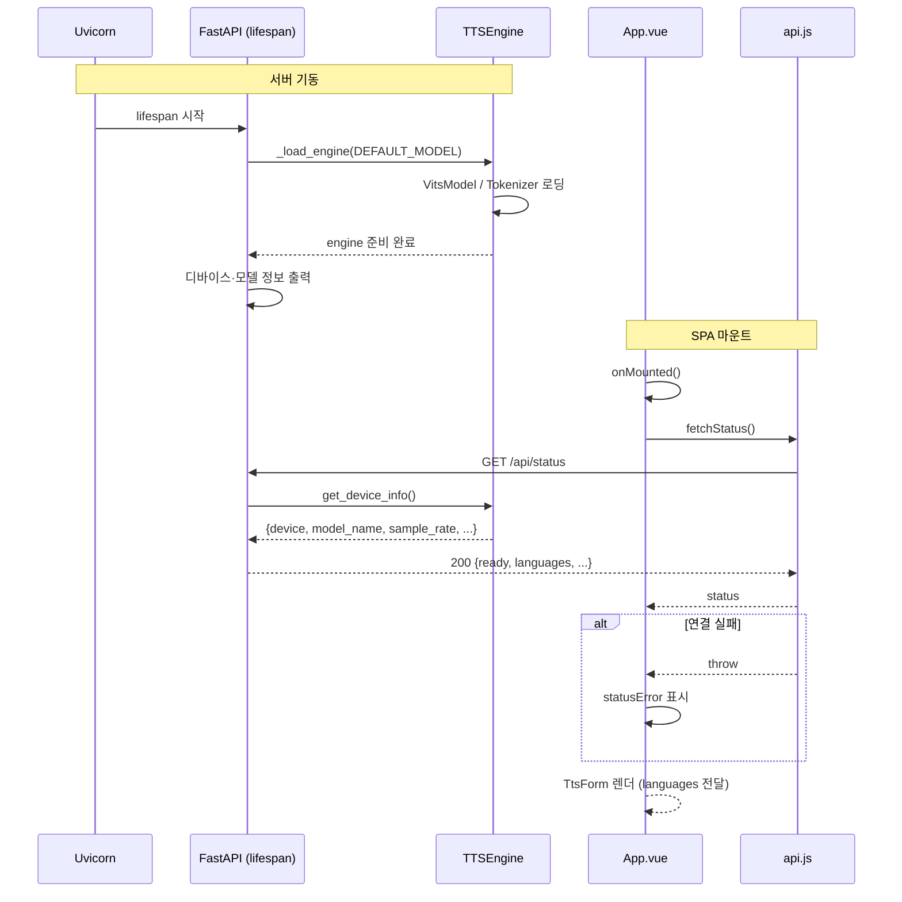
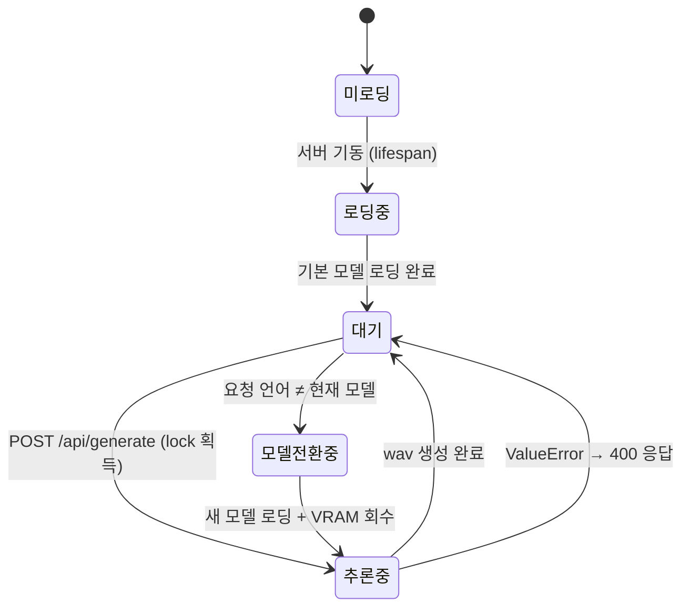
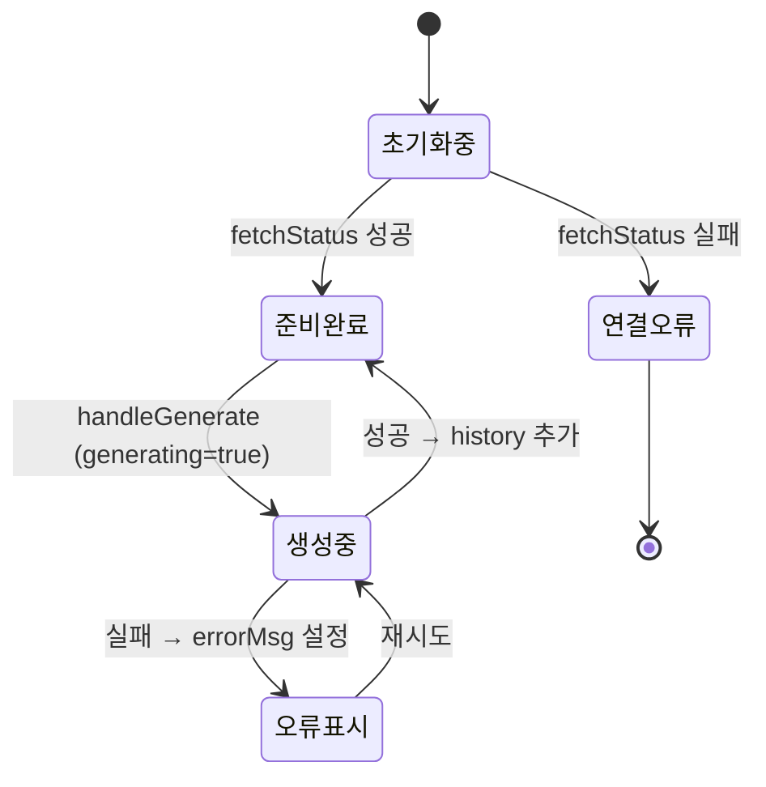

# Tiny TTS — UML 다이어그램

본 문서의 다이어그램은 [Mermaid](https://mermaid.js.org/) 문법으로 작성되었으며,
GitHub·VS Code(Markdown Preview Mermaid) 등에서 바로 렌더링된다.

## 1. 클래스 다이어그램

백엔드 핵심 클래스와 프론트엔드 컴포넌트의 정적 구조.

## 2. 컴포넌트 다이어그램

시스템 구성 요소 간의 의존 관계.

## 3. 시퀀스 다이어그램 — 음성 생성

사용자가 텍스트를 입력하고 음성을 생성하는 전체 흐름.

## 4. 시퀀스 다이어그램 — 앱 초기화 및 상태 조회

## 5. 상태 다이어그램 — 백엔드 TTS 엔진

## 6. 상태 다이어그램 — 프론트엔드 생성 흐름

